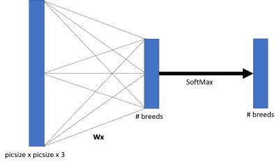
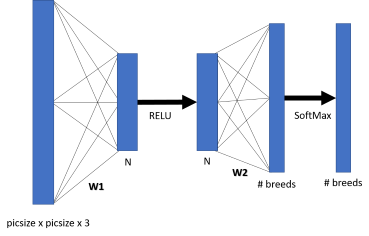
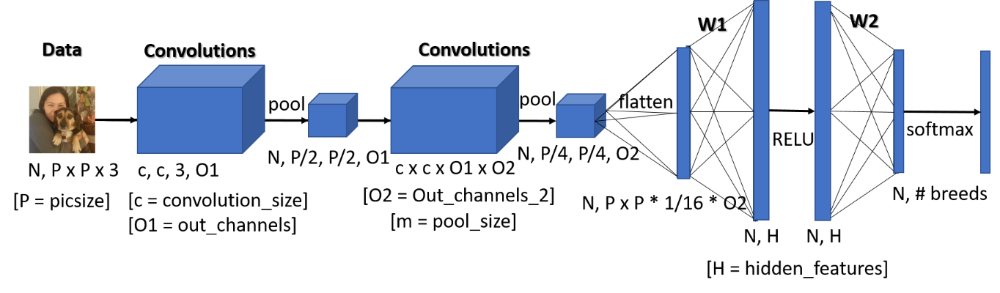

# DogClassifier
A CNN Dog Classifier in python 3 w/Tensorflow.  WIP

## Data Understanding
Starting with the Stanford Dog Dataset: [ImageNetDogs](http://vision.stanford.edu/aditya86/ImageNetDogs/).  This gives me:
> * **Number of categories:** 120
> * **Number of images:** 20,580
> * **Annotations:** Class labels, Bounding boxes

The images have the following characteristics:
* *jpg* format
* No uniform size
* Some have humans in them
* Some have multiple dogs
* Largest Dimension: 3264

## Data Preparation
The file (dog_images.py)[https://github.com/NeverForged/DogClassifier/blob/master/Source/dog_images.py] takes the [ImageNetDogs](http://vision.stanford.edu/aditya86/ImageNetDogs/) and labels them, places them in folders, normalizes them to a specified size, and mirror images them to double the dataset size.  It also resizes them to squares of a specified pixel size, creating a set of training and test files that are picsize x picsize squares, with white borders along the shorter edge of the picture.

I then use some basic shuffle techniques to shuffle my data around (to avoid it only being trained on the last breed sent through it.)

## Modeling
A number of models were tried to classify dog breeds based on photos; see [ipython notebook](https://github.com/NeverForged/DogClassifier/blob/master/Source/DogClassifier.ipynb) for details.

First I tried a fully connected network with no hidden layers with the following structure:

This was usually not better than chance; it was around 60% when comparing Beagles to Great Danes, but when running five dog breeds, it was about 25% accurate.

Using a single hidden layer as such:

Where N is some number of hidden features, and searching over N as 1-10 times the number of breeds (so 5, 10, ..., 45, 50), I found that it was sometimes worse, sometimes better, but never better than around 40%, which is not an ideal classifier.

To be honest, I wasn't convinced the above would work in the first place, especially given that the placement and positioning of dogs in the photos is arbitrary.  Maybe this would work if all photos were dogs in the same position taken at a specified distance from the dog, but otherwise there is no theoretical reason to think this would work without convolutions.

Now to create a convoluted neural network.  Setting it up to use variables, so I can reconstruct it as a class (using sklearn methods) and grid search it to find the best parameters for the situation.

Of course, now I have to grid-search the variables.

## Results & Change of Focus
Okay, so making my own model got me just over 3% Accuracy.  This isn't great, but isn't the worst either, considering [this paper's results on the same data](http://cs231n.stanford.edu/reports/2015/pdfs/fcdh_FinalReport.pdf).  So I had two ideas:
* Instead of 1 model, do 120 binary classifications, then use other machine learning tools to sort this
* Switch to a pre-made model

The first idea led to over a week of processing, and also reminds me too much of a Kaggle competition - just string together 100s of models (in my case, literally 121 models) and see what happens.  This may work, but is hardly an effective method for doing so.  I was also mainly making my own tensorflow model based on a job interview I was prepping for... that never came.  I had e-mailed them about it, and never got a response.

So, since I now have no reason to stick to only Tensorflow (passive-aggressive 'professionalism' is certainly my new favorite thing), and ssince I am still working on [a project for the UNHCR](https://github.com/NeverForged/HiveImageProject), it seems more to my best interest, and the progress of the project, to switch gears in that direction.  So I am.

## Keras - VGG16
Choosing Keras' VGG16 as the model I'll use to test this.  Now that I have a through understanding of the trials and tribulations of making my own model, time to try this on "easy mode".  So, I will pop-off the 1000 answer layer and replace with a 120-breed layer, up my dog photos to 224 by 224, and try again.
